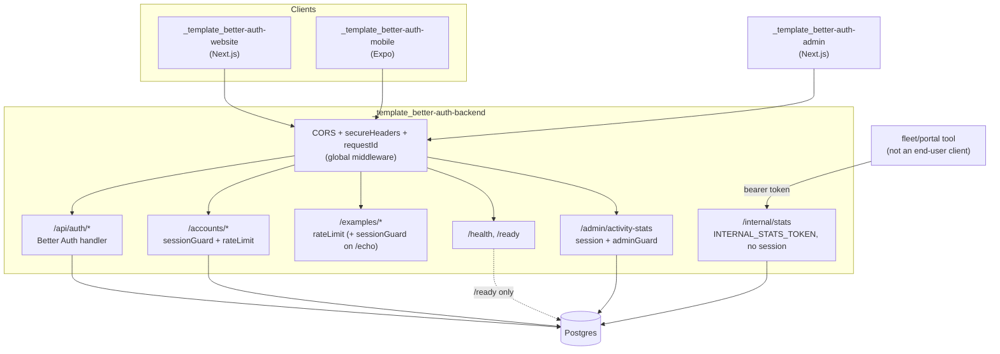
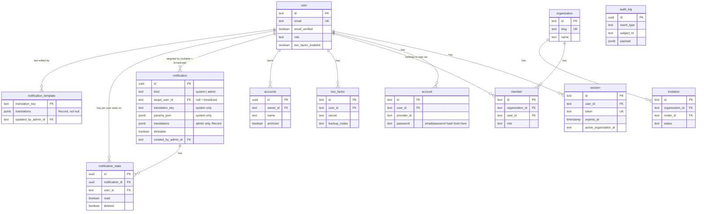
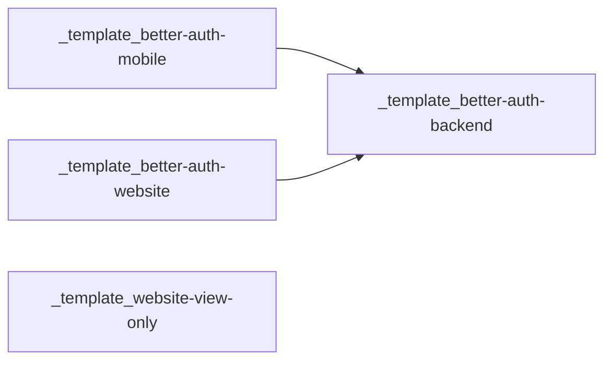

# Better Auth Backend Template

A production-shaped Hono API backing every other template in the suite (`_template_better-auth-website`, `_template_better-auth-mobile`). Better Auth owns identity end to end: sign-up, sign-in, sessions, two-factor, organizations, and admin roles. There is no second, hand-rolled auth path anywhere in this codebase — every client talks to the same session store through the same library.

Clone it, set three environment variables, run `docker compose up`, and you have a working auth backend with an audit trail, rate limiting, and a real e-mail flow. The rest of this document explains what's actually in the box and why it's built the way it is.

## Table of contents

- [Getting started](#getting-started)
- [Architecture](#architecture)
- [Data model](#data-model)
- [API reference](#api-reference)
- [Adding a new API route](#adding-a-new-api-route)
- [Configuration](#configuration)
- [Security](#security)
- [Key decisions](#key-decisions)
- [Deployment](#deployment)
- [Operations](#operations)
- [Testing and CI](#testing-and-ci)
- [How this fits into the template suite](#how-this-fits-into-the-template-suite)
- [License](#license)

## Getting started

### Docker (recommended)

```
cp .env.example .env   # set BETTER_AUTH_SECRET and POSTGRES_PASSWORD at minimum
docker compose up -d
docker compose exec backend node dist/scripts/seed-admin.js
```

`npm run seed:admin` (see [Scripts](#scripts)) is the host-mode equivalent -- it isn't available inside the container itself, since the runner image ships only the compiled `dist/` output and production dependencies, not `package.json`, `src/`, or `tsx`.

The backend container runs the committed Drizzle migrations before starting the server, so tables exist after the first boot with nothing to run by hand. The admin account is a deliberately separate, explicit step — nothing is auto-provisioned from default credentials. The `db` service's port 5432 is published to the host for local inspection (psql, Drizzle Studio); remove that mapping for a deployment where only `backend` should be reachable.

### Host mode

```
npm install
cp .env.example .env   # point DATABASE_URL at a Postgres you already have running
npm run db:migrate
npm run dev
```

```
curl http://localhost:3000/health
```

### Scripts

| Script | Purpose |
|---|---|
| `npm run dev` | Hot-reloading dev server (`tsx watch`) |
| `npm run build` | Compile to `dist/` |
| `npm run start` | Run the compiled server |
| `npm run db:generate` | Generate a Drizzle migration from schema changes |
| `npm run db:migrate` | Apply migrations via the `drizzle-kit` CLI (host mode) |
| `npm run db:migrate:runtime` | Apply migrations via Drizzle's own migrator, no `drizzle-kit` dependency needed — what the Docker image runs |
| `npm run seed:admin` | Create or promote the admin user from `ADMIN_EMAIL`/`ADMIN_PASSWORD` |
| `npm run auth:generate` | Regenerate `src/auth/auth-schema.ts` from the Better Auth config |
| `npm run lint` | ESLint |
| `npm test` | Vitest (unit + integration) |

## Architecture

Hono handles routing and middleware; Better Auth owns everything under `/api/auth/*`; Drizzle talks to Postgres. There is exactly one `betterAuth()` instance (`src/auth/auth.ts`) and exactly one Postgres pool (`src/db/client.ts`) — both are imported everywhere they're needed rather than re-created per request.



Request flow for anything under `/accounts` or `/examples/echo`: `requestId` middleware stamps an `X-Request-Id` and attaches a request-scoped logger, `secureHeaders` sets response headers, `cors` checks the origin against `trustedOrigins`, `rateLimit` checks a per-IP bucket, `sessionGuard` calls `auth.api.getSession()` and attaches `user`/`session` to the Hono context, and only then does the route handler run. Any error thrown at any stage becomes an `AppError` via `toAppError()` in `app.onError` — nothing unhandled ever reaches a client as a raw stack trace.

Layout:

```
src/
├── auth/            # Better Auth instance, generated schema, RBAC statements
├── db/               # Drizzle client, migrations, app-owned schema (accounts, audit_log)
├── lib/              # errors, email, logger, activity-stats — cross-cutting, no HTTP awareness
├── middleware/        # session-guard, rate-limit, request-id
├── routes/           # health, accounts, examples, internal-stats, admin-stats
└── scripts/          # seed-admin (CLI, not server runtime)
```

## Data model

Better Auth manages its own tables (generated into `src/auth/auth-schema.ts` by `npm run auth:generate` — do not hand-edit that file). The app owns five more: `accounts` (an example domain resource), `audit_log`, and `notification`/`notification_state`/`notification_template`.



Two tables are easy to confuse and mean completely different things: Better Auth's own `account` (singular) is per-provider credential storage — one row per sign-in method a user has, including the password hash for email/password login. The app's own `accounts` (plural, `src/db/schema/accounts.ts`) is an example CRUD resource, scoped to its owner via `owner_id`, that a real project deletes and replaces with its actual domain tables. If you're looking for where passwords live, it's `account.password`, not anything in `accounts`.

`audit_log` is written inside the same Postgres transaction as the domain mutation that triggered it (see `src/routes/accounts.ts`) and via a Better Auth `databaseHooks.session.create` hook (see `src/auth/auth.ts`) — session creation and every accounts mutation leave a row. This only works because auth and domain data share one database; a previous, Keycloak-based version of this stack could not do this since identity lived in a separate system.

`notification`/`notification_state` use a lazy-state model: no `notification_state` row for a given `(notification_id, user_id)` pair means "unread, not deleted" for that user — read/unread/delete only ever upsert one row (unique index on that pair) instead of pre-seeding a row per recipient on every broadcast. A `system` notification (e.g. the post-signup welcome, written by the `databaseHooks.user.create` hook in `src/auth/auth.ts`) carries `translation_key`/`params_json` so every client renders it in the viewer's own language; an `admin` notification (created via `/admin/notifications`) is pre-translated into a `translations` JSONB blob instead (`Record<langCode, {title, body}>`, keyed by the shared `SUPPORTED_LANGUAGES` registry used by the website/mobile `t()` contexts — see [[ADR-009]]), since there is no machine translation here.

`notification_template` lets an admin override a `system` notification's built-in translation-key text (see `/admin/notification-templates` below) — one row per known `translation_key` (the registry lives in `src/routes/admin-notification-templates.ts`'s `NOTIFICATION_TEMPLATE_KEYS`), holding a `translations` JSONB blob (`de`/`en` required, any other supported language optional) instead of a key clients resolve themselves. The `databaseHooks.user.create` hook looks this table up when it writes the welcome notification and bakes the override's `translations` into that row if one exists — so editing a template only affects *future* notifications of that kind, same as any other already-created row never retroactively changing. No override yet (the common case) means `translations` stays `null` and clients fall back to their local `translation_key` text, so this is not a breaking change. This table previously held fixed `title_de`/`title_en`/`body_de`/`body_en` columns — a JSONB blob replaced them so a new language is a registry entry, not a schema migration (see `src/db/migrations/0003_add-notification-translations-jsonb.sql` through `0005_drop-notification-legacy-de-en-columns.sql`).

## API reference

| Route | Method | Auth | Notes |
|---|---|---|---|
| `/api/auth/*` | GET, POST | varies | Better Auth's own routes: sign-up, sign-in, session, 2FA, organization, admin. See `/api/auth/reference` for the generated OpenAPI docs. |
| `/health` | GET | none | Liveness — never touches the database, can't flap on a Postgres blip |
| `/ready` | GET | none | Readiness — pings Postgres, returns 503 if unreachable |
| `/accounts` | GET | session | List the caller's own accounts |
| `/accounts/:id` | GET | session | Fetch one, 404 (not 403) if it belongs to someone else |
| `/accounts` | POST | session | Create, writes an `audit_log` row in the same transaction |
| `/accounts/:id` | PATCH | session | Update, same ownership scoping |
| `/accounts/:id` | DELETE | session | Delete, same ownership scoping |
| `/examples/ping` | GET | none | Rate-limited health-style example. Returns `{ status, timestamp }` |
| `/examples/echo` | POST | session | Rate-limited, Zod-validated `{ message }` in, `{ message, userId, receivedAt }` out |
| `/internal/stats` | GET | `INTERNAL_STATS_TOKEN` bearer token | Aggregate counts only (total users, new users last 7 days, active sessions, `audit_log` event-type breakdown) — never raw rows. Not gated by a Better Auth session; see [Security](#security) for why. Returns 503 if `INTERNAL_STATS_TOKEN` is unset (fails closed) |
| `/admin/activity-stats` | GET | session + `adminGuard` | Query: `interval` (`day`\|`week`), `period` (`7d`\|`30d`\|`90d`). Per-bucket New/Active/Retained/Reactivated user counts plus period-over-period `changePercent`, for `_template_better-auth-admin`'s dashboard. "Active" = had a session created in the window (a login proxy, not request-level activity — this backend has none). Classification logic is a pure function in `src/lib/activity-stats.ts`, unit-tested separately from the DB query in `src/routes/admin-stats.ts` |
| `/admin/send-verification-email` | POST | session + `adminGuard` | Body: `{ userId, callbackURL? }`. Re-enters Better Auth server-side (no session) to send a verification e-mail for a **different** user — the client-side `sendVerificationEmail` endpoint requires the signed-in session's email to match the target (`EMAIL_MISMATCH`), so an admin can never use it for anyone else; the server-side anonymous path has no such check. 404 if the user doesn't exist, 409 if already verified. Backs the admin dashboard's "Resend verification email" button (`src/routes/admin-emails.ts`, integration-tested in `src/routes/admin-emails.test.ts`) |
| `/notifications` | GET | session | Own visible notifications (broadcast + targeted, minus own soft-deletes). Query: `filter` (`unread`\|`read`, omit for all) |
| `/notifications/unread-count` | GET | session | `{ count }` for the bell badge |
| `/notifications/:id/read` \| `/unread` | POST | session | Upserts the caller's `notification_state` row. 404 if the notification isn't visible to the caller |
| `/notifications/:id` | DELETE | session | Soft-delete (own `notification_state` row only). 403 if `deletable` is false, 404 if not visible to the caller |
| `/admin/notifications` | GET | session + `adminGuard` | All admin-authored notifications (not system ones), newest first. Each row includes `targetUserEmail` (joined for display, `null` for a broadcast) |
| `/admin/notifications` | POST | session + `adminGuard` | Body: `{ targetUserId?, translations, deletable }` where `translations` is `Record<langCode, {title, body}>` with `de`/`en` required. Omit `targetUserId` for a broadcast |
| `/admin/notifications/:id` | DELETE | session + `adminGuard` | Hard delete — cascades `notification_state` rows via FK |
| `/admin/notification-templates` | GET | session + `adminGuard` | One row per known `translation_key` (`NOTIFICATION_TEMPLATE_KEYS`), `translations` `null` when there's no override yet |
| `/admin/notification-templates/:key` | PATCH | session + `adminGuard` | Body: `{ translations }` (`Record<langCode, {title, body}>`, `de`/`en` required, other supported languages optional). Upserts the override. 404 if `key` isn't in `NOTIFICATION_TEMPLATE_KEYS` |
| `/admin/notification-templates/:key` | DELETE | session + `adminGuard` | Reverts to no-override (deletes the row, idempotent). 404 if `key` isn't in `NOTIFICATION_TEMPLATE_KEYS` |

`/accounts` and `/examples` are both deliberately thin — the first is a real, ownership-scoped resource meant as a pattern to copy for actual domain routes; the second is even thinner and exists mainly as the connectivity check the website and mobile templates call to confirm they can reach this backend at all. Delete `/examples` once a project has its own routes to model instead; keep or replace `/accounts` the same way.

`/internal/stats` exists for a different kind of caller than everything else in this table: not an end user's browser/app, but another backend — a central fleet/portal tool aggregating KPIs across many deployed instances of this template (see `project-portal-backend` in the company's `project-portal` repo for a real consumer). That's why it's token-gated instead of session-gated: such a caller has no user account on this instance at all.

## Adding a new API route

A checklist for a new dev adding an endpoint. `src/routes/accounts.ts` is the reference implementation — it's the "real, ownership-scoped resource" the [API reference](#api-reference) table already points at as the pattern to copy, and it uses every piece described below in one file. Keep it open while you read this.

**1. Pick or create a route file.** One file per resource under `src/routes/` — a new resource gets a new file (`workouts.ts`, `gyms.ts`, ...), a new action on an existing resource is a new handler in that file. Each file exports its own `Hono<SessionEnv>()` scoped to just that resource, not the whole app, plus a rate limit:

```ts
export const widgetRoutes = new Hono<SessionEnv>();
widgetRoutes.use("*", rateLimit({ windowMs: 60_000, max: 60 }));
```

**2. Validate the input.** Define a Zod schema and wire it with `@hono/zod-validator`'s `zValidator`, throwing `ValidationError` — not a bare `c.json(..., 400)` — on failure, so bad input goes through the same error path as everything else:

```ts
const createWidgetSchema = z.object({ name: z.string().max(100) }).strict();

widgetRoutes.post(
  "/",
  zValidator("json", createWidgetSchema, (result) => {
    if (!result.success) throw new ValidationError("Invalid request body", { details: result.error.issues });
  }),
  async (c) => {
    const body = c.req.valid("json");
    // ...
  },
);
```

`.strict()` isn't decoration — it's what stops an extra body field from silently reaching a query.

**3. Guard it.** `sessionGuard` (`src/middleware/session-guard.ts`) for anything that needs a logged-in user, `adminGuard` for admin-only, nothing at all for a genuinely public read. If a handler touches one specific row, filter by *both* the row's id and the caller's id in the same query, and respond with `NotFoundError` — never `ForbiddenError` — when it belongs to someone else. A 403 confirms the row exists; a 404 doesn't. `accounts.ts`'s `GET /:id` is the example.

**4. Throw errors, don't format them.** Every class in `src/lib/errors.ts` (`NotFoundError`, `ConflictError`, `TooManyRequestsError`, ...) maps to its HTTP status in exactly one place: `app.onError` in `src/index.ts`. Throw the typed error from inside the route and stop thinking about status codes there.

**5. Talk to the DB through Drizzle.** Import `db` from `src/db/client.ts` and the table from `src/db/schema/*.ts`. A new column or table means editing/adding a schema file there, then:

```
npm run db:generate   # writes a migration from the schema diff
npm run db:migrate    # applies it locally
```

Commit the generated migration file — it's what actually runs on deploy, the schema file alone changes nothing in a running database.

**6. Mount the router.** One line in `src/index.ts`, alongside the existing `app.route("/accounts", accountsRoutes)`:

```ts
app.route("/widgets", widgetRoutes);
```

Ordering only matters *within* a single file: a static path (`/search`) has to be registered before a dynamic one (`/:id`) that would otherwise swallow it as a parameter value.

**7. Test against a real session, not a mock.** Add `widgets.test.ts` next to the route file. Mount just that router plus `app.onError` in a throwaway `Hono` instance, create a real (verified) user through `auth.api.createUser`/`auth.api.signInEmail`, and reuse its session cookie — `accounts.test.ts`'s `createVerifiedUserWithCookie` helper is the one to copy. This needs a real `DATABASE_URL` (`docker compose up -d db` gives you one) and is deliberately not mocked: a broken `sessionGuard` never fails a test that mocks the session past it.

That's the whole loop — schema → route file → validate → guard → mount → test. None of it is a framework decision; it's copying `accounts.ts` and changing the domain-specific middle.

## Configuration

All variables live in `.env.example`. The ones worth calling out specifically:

| Variable | Required | Purpose |
|---|---|---|
| `BETTER_AUTH_SECRET` | yes | Signs/encrypts cookies and tokens. Generate with `npx @better-auth/cli secret` |
| `DATABASE_URL` | yes | Postgres connection string, shared by Drizzle and Better Auth's adapter |
| `WEB_ORIGIN` | yes | Website's origin, added to `trustedOrigins` |
| `MOBILE_SCHEME` | no | Mobile app's deep-link scheme, added to `trustedOrigins` for OAuth callbacks. Expo Go's dev-mode `exp://<lan-ip>:<port>` origin is trusted automatically instead (see `BACKEND_URL` below), no separate config needed for that |
| `BACKEND_URL` | yes | This server's own public URL, passed as `baseURL` so it doesn't guess its origin behind a reverse proxy. Its scheme (`http://` vs `https://`) also decides whether cookies are `Secure`-flagged and whether Expo Go's `exp://` origin is trusted — see `src/auth/auth.ts`'s `isHttpsDeployment` and [Security](#security) |
| `RESEND_API_KEY` / `EMAIL_FROM` | no | Enables real verification/reset-password e-mails via Resend. Unset in dev falls back to logging the e-mail instead of sending it |
| `SMTP_HOST` / `SMTP_PORT` / `SMTP_SECURE` / `SMTP_USER` / `SMTP_PASSWORD` | no | Alternative e-mail path via your own SMTP server (`src/lib/email.ts`, `nodemailer`). Takes priority over `RESEND_API_KEY` when both are set — precedence is SMTP → Resend → dev log fallback |
| `DB_POOL_MAX` / `DB_POOL_MIN` / `DB_POOL_IDLE_TIMEOUT_MS` / `DB_POOL_CONNECTION_TIMEOUT_MS` | no | Explicit `pg` pool bounds — an unbounded pool was a documented weakness of a previous version of this stack |
| `ADMIN_EMAIL` / `ADMIN_PASSWORD` / `ADMIN_NAME` | no | Consumed only by `npm run seed:admin`, never read by the running server |
| `INTERNAL_STATS_TOKEN` | no | Bearer token for `GET /internal/stats`. Unset means the endpoint always responds 503, not a silent 401 — fails closed by default. Generate any long random value, e.g. `openssl rand -hex 32` |

The verification and password-reset e-mails are HTML, built by `src/lib/emailTemplate.ts` (`buildVerifyEmailEmail`/`buildResetPasswordEmail`) and wired up in `src/auth/auth.ts` (`emailVerification.sendVerificationEmail` and `emailAndPassword.sendResetPassword`) — no external template system, just template-literal HTML passed to `sendEmail()`. The card layout, colors, and `assets/lpj-its-logo.png` logo (embedded via `cid:`, see `sendEmail`'s `attachments` param in `src/lib/email.ts`) are LPJ IT-Solutions' generic template branding — the product name and primary color come from `src/project.config.ts` (`appName`/`primaryColor`, re-exported by `emailTemplate.ts` as `APP_NAME`/`BRAND.primary`); the rest of `BRAND` and the logo file are edited directly. The link target inside those e-mails is controlled by the client apps, not here — see the website's/mobile's own README for `NEXT_PUBLIC_SITE_URL`/`EXPO_PUBLIC_WEBSITE_URL`. Exception: for the password-reset e-mail, `sendResetPassword` appends a fallback `callbackURL` pointing at the website's `/reset-password` page (first `WEB_ORIGIN`) when the calling client doesn't pass a `redirectTo` — otherwise the emailed link would dead-end on the backend's callback handler (it rejects links without a `callbackURL`).

### Rebranding this template for a new project

| What | Where |
|---|---|
| Product name, primary color | `src/project.config.ts` (`appName`, `primaryColor`) — a plain TS module rather than JSON, since this repo's Node-ESM + tsx runtime needs an import attribute for JSON imports that a TS module doesn't. Also update the German subject lines in `src/auth/auth.ts` if you rename the product in a way that changes how they should read |
| Rest of the email brand palette | `src/lib/emailTemplate.ts`'s `BRAND` — kept in sync by hand with the website/admin templates' `--primary`/`--border` CSS tokens, since mail clients can't read CSS variables |
| Email logo | `assets/lpj-its-logo.png` — also update `Dockerfile`'s `COPY ... ./assets` step only if you rename the directory, not the file |
| Email language | `src/lib/emailTemplate.ts`/`src/auth/auth.ts`'s subject lines are hardcoded German (`lang="de"`) — there's no language on the user record to pick from, so a different default means editing these strings directly |
| Deployed origins / secrets | `.env` — `BETTER_AUTH_SECRET`, `DATABASE_URL`/`POSTGRES_*`, `WEB_ORIGIN`, `MOBILE_SCHEME`, `BACKEND_URL`, `COOKIE_DOMAIN` |
| First admin account | `.env`'s `ADMIN_EMAIL`/`ADMIN_PASSWORD`/`ADMIN_NAME`, consumed once by `npm run seed:admin` |

## Security

- Session and token validation is entirely Better Auth's — there is no hand-rolled JWT verification anywhere in this codebase.
- Authorization is a typed access-control statement set (`src/auth/permissions.ts`), not scattered `if (user.role === ...)` checks.
- Every route that touches a specific row filters by both the row's ID and the caller's `ownerId` in the same query — a request for someone else's resource returns 404, never a 403 that would confirm the resource exists.
- CORS is locked to an explicit `trustedOrigins` list, never a wildcard.
- Cookies are `Secure`-flagged only when `BACKEND_URL` starts with `https://` (**not** `NODE_ENV`, which is unreliable for this — the Docker `backend` service always sets `NODE_ENV=production` for its own unrelated reason, even for plain-HTTP local/LAN/Expo-Go testing; keying `Secure` off that would make every spec-compliant HTTP client silently drop the session cookie post-sign-in). Same `isHttpsDeployment` signal also gates whether Expo Go's dev-mode `exp://` origin is trusted.
- `secureHeaders` sets `X-Content-Type-Options`, `X-Frame-Options: DENY`, and a `Referrer-Policy`. There is deliberately no Content-Security-Policy here — this is a JSON API with no HTML to protect; the nonce-based CSP in the website template would be meaningless noise on this server.
- Rate limiting is in-memory and per-instance — correct for this template's single-replica default, wrong once you run more than one backend replica behind a load balancer (each instance keeps its own counters). Swap `src/middleware/rate-limit.ts`'s `Map` for a Redis-backed limiter (for example `@upstash/ratelimit`) before scaling horizontally.
- Errors are normalized through `AppError`/`toAppError()` before they ever reach a response — an unhandled exception becomes an opaque 500 with a logged stack trace server-side, never a leaked internal message.
- `GET /internal/stats` is deliberately **not** gated by a Better Auth session/`adminGuard` — its caller is another backend, with no user account here at all (see [API reference](#api-reference)). A single static token, compared with `crypto.timingSafeEqual` rather than `===` (constant-time, so a wrong guess can't be narrowed down via response timing), is the whole auth mechanism. It can only ever read this one aggregate endpoint — nothing else `adminGuard` protects is reachable with it.

## Key decisions

Short version of decisions with real consequences if reversed. Full ADRs for the ones that affect the whole suite live in the company vault, not duplicated here in full.

- **Better Auth as the single identity provider.** No hand-rolled JWT verification, no second session mechanism anywhere in the suite. A previous Keycloak-based backend had incomplete JWT audience validation; centralizing on one library's own session lookups closes that entire class of bug rather than patching one instance of it.
- **One shared Postgres for auth and domain data**, not a separate identity database. This is what makes the transactional `audit_log` writes possible, and it's the reason a project doesn't need a second database just to add its own tables next to Better Auth's.
- **In-memory rate limiting**, not a Redis dependency, as the template default. Correct for a single instance, a real trade-off once you scale — see [Security](#security). Adding a new dependency for a template that might never need it would be the wrong default; the upgrade path is documented in the code, not built in advance.
- **Resend with a console-log dev fallback for e-mail**, rather than requiring an e-mail provider account just to run the template locally. `requireEmailVerification: true` needs *some* way to actually send the verification link — logging it in development means the flow is fully testable with zero external accounts, and production just needs one API key.
- **`/examples/*` as a disposable, intentionally trivial route pair.** It exists to be deleted. Its job is to be the smallest possible thing that proves a client can reach this backend and that a session-guarded route actually enforces a session — not to demonstrate anything more elaborate.

## Deployment

`deploy.sh` (repo root) is a general-purpose deploy/redeploy script, part of
this template — every project scaffolded via `create-better-auth-app` gets
it automatically, since it's just a file in this repo. It's docker-compose
based (build + a `db` dependency) and mirrors the suite-wide
`redeploy-websites.sh`'s calling convention (positional args, manual-env-file
→ Infisical → standard secrets fallback), so a Jenkins pipeline for this
repo can call it the same way an existing website pipeline calls
`redeploy-websites.sh`:

```groovy
pipeline {
    agent any

    environment {
        SERVER_IP = "<server-ip>"
        SSH_USER = "jenkins"
        SSH_CREDENTIAL_ID = "<jenkins-ssh-credential-id>"
        TARGET_DIR = "/var/www/vhosts/<domain>/httpdocs"
        PORT = "3000"
        INFISICAL_PROJECT_ID = "<infisical-project-id>"
        INFISICAL_URL = "https://app.infisical.com/api"
    }

    stages {
        stage('Checkout Code') {
            steps {
                checkout scm
            }
        }

        stage('Deploy to Server') {
            steps {
                sshagent([SSH_CREDENTIAL_ID]) {
                    sh "ssh -o StrictHostKeyChecking=no ${SSH_USER}@${SERVER_IP} 'mkdir -p ${TARGET_DIR}'"
                    // Excludes .git and Jenkinsfile, same as the website pipelines --
                    // deploy.sh travels with the rest of the repo, so no separate
                    // "two directories up" shared script needed like
                    // redeploy-websites.sh.
                    sh "rsync -rlvz --exclude='.git' --exclude='Jenkinsfile' ./ ${SSH_USER}@${SERVER_IP}:${TARGET_DIR}/"

                    sh """
                    ssh -o StrictHostKeyChecking=no ${SSH_USER}@${SERVER_IP} '
                        cd ${TARGET_DIR} &&
                        sudo ./deploy.sh deploy ${PORT} ${INFISICAL_PROJECT_ID} ${INFISICAL_URL}
                    '
                    """
                }
            }
        }
    }
}
```

`./deploy.sh deploy [port] [infisical-project-id] [infisical-domain] [env-file]`
always binds to `127.0.0.1` (not `compose.yml`'s own local/LAN-dev default of
`0.0.0.0`) — this script represents an actual deploy, so the raw port is
never exposed to the internet directly, only through whatever reverse proxy
sits in front of it. Run without arguments for an interactive menu (deploy,
restart without rebuilding, seed/promote an admin).

## Operations

Common procedures. Longer, execution-ready runbooks (including things you'd only need once, like restoring from a backup) live in the company vault's `20_Products/Better Auth Template Suite/Known Issues & Runbooks/`.

**Rotate `BETTER_AUTH_SECRET`.** Every existing session and signed cookie becomes invalid the moment the secret changes — treat it as a "log everyone out" operation, not a silent hot-swap. Generate a new one with `npx @better-auth/cli secret`, update it wherever the backend reads its environment (`.env`, your host's secret store), and restart the process.

**Promote a user to admin.** `npm run seed:admin` is idempotent: if `ADMIN_EMAIL` already exists, it promotes that account to `role: "admin"` and marks it verified instead of erroring. Safe to re-run. That `npm` script only works host-mode (`tsx`, a devDependency, isn't in the production image) — against a deployed container, use `./deploy.sh seed-admin` instead (see [Deployment](#deployment)), which prompts for the email/password/name interactively rather than reading them from `.env`.

**Check readiness before routing traffic.** `GET /ready` is the one that actually checks Postgres; `GET /health` intentionally never touches the database, so point your orchestrator's liveness probe at `/health` and its readiness/load-balancer registration at `/ready` — not the other way around.

**Website/admin stuck in a login loop in production, across subdomains.** By default Better Auth scopes the session cookie to the exact host that answered sign-in. Deploying the backend and its clients on *different* subdomains of the same domain (e.g. `app.example.com` for the website, `api.example.com` for this backend, `admin.example.com` for an admin dashboard) means the cookie the backend sets is invisible to the other subdomains unless explicitly widened. Sign-in itself still succeeds (200, valid session in the response body) — the loop happens purely because the follow-up request from the website/admin carries no cookie at all. Fix: set `COOKIE_DOMAIN` in `.env` to the shared *registrable* domain (`example.com`, not `api.example.com`) — `src/auth/auth.ts` already reads it and enables Better Auth's `crossSubDomainCookies` for it, gated behind `isHttpsDeployment` (see that file's comment for why the gate matters — an unconditional `Domain` there would silently break local/LAN dev). No code change needed for this specific fix, just the env var.

**Then verify the fix actually shipped before touching anything else** — an env var change alone does not fix a *running* deployment:

```bash
curl -si -X POST https://api.example.com/api/auth/sign-in/email \
  -H "Content-Type: application/json" -d '{"email":"...","password":"..."}' | grep -i set-cookie
```

Confirm `Domain=example.com` is present in the output. If it's missing, the *running container* is still using the old `.env` — a `docker compose restart` doesn't re-read `.env`, and a `build` that raced an old crash-looping container and never actually became the live one leaves the old config running indefinitely with no error anywhere (check `docker container list`'s `IMAGE` column for a bare hash instead of the expected tag — that's the tell). Always `docker compose down && docker compose up -d` (recreate, not restart) after a `.env` change in production, and re-run the `curl` check above to confirm before assuming it's fixed. Don't chase CORS or `SameSite`/`__Secure-` cookie-prefix theories first — verify the actual `Set-Cookie` header with `curl` before forming a hypothesis; it rules out or confirms most of the credible causes in one step.

## Testing and CI

`npm test` runs Vitest: unit tests for `permissions.ts`, `errors.ts`, and the rate-limit middleware need nothing running; the accounts ownership-scoping test in `src/routes/accounts.test.ts` and the `internal-stats.test.ts` token-gate tests both need a real `DATABASE_URL` (the same Postgres `docker compose up -d db` gives you) since they exercise actual sign-up/sign-in against Better Auth and real aggregate queries rather than mocking either. `.github/workflows/ci.yml` runs lint, `tsc --noEmit`, migrations, build, and the full test suite against a Postgres service container on every push and pull request.

## How this fits into the template suite



Both `_template_better-auth-website` and `_template_better-auth-mobile` are pure clients of this server — neither has a session store, a user table, or any auth logic of its own. The website calls this API directly from the browser (see its `src/lib/auth-client.ts`); the mobile app does the same over `@better-auth/expo`'s client plugin, with sessions in the OS keychain via `expo-secure-store`. This server registers the matching server-side `expo()` plugin (`src/auth/auth.ts`) — required, not optional, since the mobile client sends a custom `expo-origin` header instead of a real `Origin` (native `fetch` can't set that reserved header), and better-auth's own origin-check middleware would otherwise reject every authenticated mutation the mobile app makes. `_template_website-view-only` has no backend connection at all and is unrelated to this server. Adding a new client to the suite means pointing `createAuthClient({ baseURL })` at this backend's `BACKEND_URL` and adding that client's origin to `trustedOrigins` — nothing here needs to change to support it.

## License

See [LICENSE](./LICENSE).

---

&copy; [lpj.app](https://github.com/lpj-app). Proprietary -- all rights reserved.
