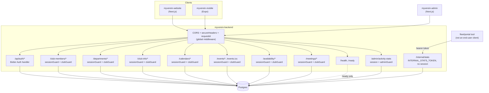
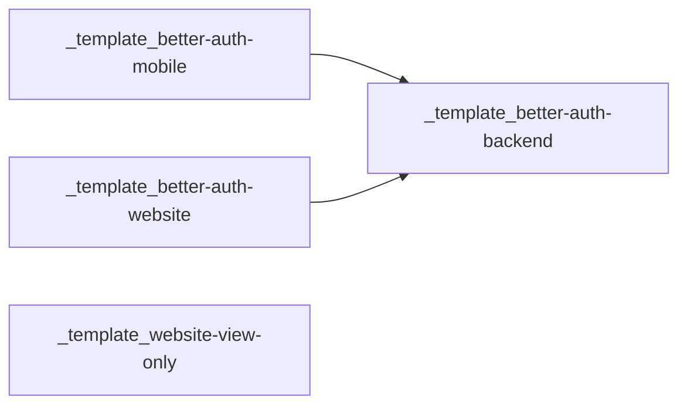

# MyVerein Backend

A Hono API for MyVerein, a club-management product for German-style Vereine (Mitgliederverwaltung, Kalender/Treffen, Lager/Material, Standort-Infocenter — see the [MyVerein Concept](../../lpj-its-vault/20_Products/MyVerein/01_Concept%20&%20Planning/Concept%20-%20MyVerein.md) in the company vault). Forked from the Better Auth Template Suite's `_template_better-auth-backend`; Better Auth still owns identity end to end (sign-up, sign-in, sessions, two-factor, organizations, admin roles) — nothing here re-implements auth.

A club is a Better Auth `organization`; a club membership is Better Auth's `member` row, extended with an app-owned `club_memberships` sidecar (member number, category, join/leave date, emergency contact) plus a `club_roles` table for fine-grained board/department roles (Vorsitz, Kassenwart, Trainer, ...) layered on top of Better Auth's own coarse `member.role`. See [Data model](#data-model) for the full shape and [Key decisions](#key-decisions) for why the role model is split this way.

Clone it, set three environment variables, run `docker compose up`, and you have a working backend with an audit trail, rate limiting, and a real e-mail flow. The rest of this document explains what's actually in the box and why it's built the way it is.

## Table of contents

- [Getting started](#getting-started)
- [Architecture](#architecture)
- [Data model](#data-model)
- [API reference](#api-reference)
- [Adding a new API route](#adding-a-new-api-route)
- [Configuration](#configuration)
- [Security](#security)
- [Key decisions](#key-decisions)
- [Deployment](#deployment)
- [Operations](#operations)
- [Testing and CI](#testing-and-ci)
- [How this fits into the template suite](#how-this-fits-into-the-template-suite)
- [License](#license)

## Getting started

### Docker (recommended)

```
cp .env.example .env   # set BETTER_AUTH_SECRET and POSTGRES_PASSWORD at minimum
docker compose up -d
docker compose exec backend node dist/scripts/seed-admin.js
```

`npm run seed:admin` (see [Scripts](#scripts)) is the host-mode equivalent -- it isn't available inside the container itself, since the runner image ships only the compiled `dist/` output and production dependencies, not `package.json`, `src/`, or `tsx`.

The backend container runs the committed Drizzle migrations before starting the server, so tables exist after the first boot with nothing to run by hand. The admin account is a deliberately separate, explicit step — nothing is auto-provisioned from default credentials. The `db` service's port 5432 is published to the host for local inspection (psql, Drizzle Studio); remove that mapping for a deployment where only `backend` should be reachable.

### Host mode

```
npm install
cp .env.example .env   # point DATABASE_URL at a Postgres you already have running
npm run db:migrate
npm run dev
```

```
curl http://localhost:3000/health
```

### Scripts

| Script | Purpose |
|---|---|
| `npm run dev` | Hot-reloading dev server (`tsx watch`) |
| `npm run build` | Compile to `dist/` |
| `npm run start` | Run the compiled server |
| `npm run db:generate` | Generate a Drizzle migration from schema changes |
| `npm run db:migrate` | Apply migrations via the `drizzle-kit` CLI (host mode) |
| `npm run db:migrate:runtime` | Apply migrations via Drizzle's own migrator, no `drizzle-kit` dependency needed — what the Docker image runs |
| `npm run seed:admin` | Create or promote the admin user from `ADMIN_EMAIL`/`ADMIN_PASSWORD` |
| `npm run seed:club` | Bootstrap a demo club and make `ADMIN_EMAIL` its "vorsitz" — needed for local dev since there is no public "create club" route yet (Wave 1), see `src/scripts/seed-club.ts` |
| `npm run auth:generate` | Regenerate `src/auth/auth-schema.ts` from the Better Auth config |
| `npm run lint` | ESLint |
| `npm test` | Vitest (unit + integration) |

## Architecture

Hono handles routing and middleware; Better Auth owns everything under `/api/auth/*`; Drizzle talks to Postgres. There is exactly one `betterAuth()` instance (`src/auth/auth.ts`) and exactly one Postgres pool (`src/db/client.ts`) — both are imported everywhere they're needed rather than re-created per request.



Request flow for anything under `/club-members`, `/departments`, `/club-info`, `/calendars`, `/events`, `/availability`, or `/meetings`: `requestId` middleware stamps an `X-Request-Id` and attaches a request-scoped logger, `secureHeaders` sets response headers, `cors` checks the origin against `trustedOrigins`, `rateLimit` checks a per-IP bucket, `sessionGuard` calls `auth.api.getSession()` and attaches `user`/`session`, `clubGuard` resolves which club (`organization`) the request is for and attaches `clubId`/`membership`/`clubRoleTypes` — and only then does the route handler run. `POST /club-members/apply` is the one exception: it deliberately skips `clubGuard` (the applicant isn't a member yet), see [Key decisions](#key-decisions). `GET /events.ics` is mounted separately at top level (see [Layout](#architecture) below) but runs the same `sessionGuard` + `clubGuard` chain — there is no unauthenticated calendar-feed link, see [Key decisions](#key-decisions). Any error thrown at any stage becomes an `AppError` via `toAppError()` in `app.onError` — nothing unhandled ever reaches a client as a raw stack trace.

Layout:

```
src/
├── auth/             # Better Auth instance, generated schema, RBAC statements
├── db/                # Drizzle client, migrations, app-owned schema (club_memberships, departments,
│                       #   club_roles, guardian_links, club_info_pages, audit_log, calendars,
│                       #   calendar_visibility, events, event_attendees, availability_slots,
│                       #   availability_exceptions, meetings, meeting_invitees, meeting_attendance,
│                       #   meeting_resolutions)
├── lib/               # errors, email, logger, activity-stats, club-permissions, calendar-visibility,
│                       #   availability-match, ics — cross-cutting, no HTTP awareness
├── middleware/         # session-guard, club-guard, rate-limit, request-id
├── routes/            # health, club-members, departments, club-info, calendars, events, availability,
│                       #   meetings, internal-stats, admin-stats
└── scripts/           # seed-admin, seed-club (CLI, not server runtime)
```

## Data model

Better Auth manages its own tables (generated into `src/auth/auth-schema.ts` by `npm run auth:generate` — do not hand-edit that file), including `organization`/`member`/`invitation` from the `organization()` plugin, which MyVerein uses as its club/membership fundament (a club **is** an `organization`). The app owns twenty-six more: the Wave 1 set — `club_memberships`, `departments`, `club_roles`, `guardian_links`, `club_info_pages`, `audit_log`, and `notification`/`notification_state`/`notification_template` (unchanged from the suite) — the Wave 2 calendar/meeting set — `calendars`, `calendar_visibility`, `events`, `event_attendees`, `availability_slots`, `availability_exceptions`, `meetings`, `meeting_invitees`, `meeting_attendance`, `meeting_resolutions` — and the Wave 3 location/inventory set — `locations`, `location_key_holders`, `location_wifi_networks`, `location_links`, `inventory_items`, `inventory_loans`, `inventory_damage_reports`. See the company vault's [Data Model - MyVerein Backend](../../lpj-its-vault/30_Engineering%20&%20Tech/System%20Design/MyVerein/Data%20Model%20-%20MyVerein%20Backend.md) for the full planning doc.

```mermaid
erDiagram
    user ||--o{ session : "has"
    user ||--o{ account : "has"
    user ||--o{ member : "belongs to clubs via"
    user ||--o{ two_factor : "has"
    organization ||--o{ member : "has"
    organization ||--o{ invitation : "has"
    organization ||--o{ departments : "has"
    organization ||--o{ club_info_pages : "has"
    member ||--o| club_memberships : "extends"
    member ||--o{ club_roles : "has"
    member ||--o{ guardian_links : "guards (as guardian)"
    member ||--o{ guardian_links : "is guarded (as ward)"
    departments ||--o{ club_roles : "scopes (optional)"
    organization ||--o{ calendars : "has"
    departments ||--o{ calendars : "scopes (optional)"
    calendars ||--o{ calendar_visibility : "has"
    calendars ||--o{ events : "has"
    events ||--o{ event_attendees : "has"
    member ||--o{ availability_slots : "has"
    member ||--o{ availability_exceptions : "has"
    organization ||--o{ meetings : "has"
    meetings ||--o{ meeting_invitees : "has"
    meetings ||--o{ meeting_attendance : "has"
    meetings ||--o{ meeting_resolutions : "has"
    organization ||--o{ locations : "has"
    locations ||--o{ location_key_holders : "has"
    locations ||--o{ location_wifi_networks : "has"
    locations ||--o{ location_links : "has"
    locations ||--o{ events : "hosts (optional)"
    locations ||--o{ meetings : "hosts (optional)"
    organization ||--o{ inventory_items : "has"
    locations ||--o{ inventory_items : "stores"
    inventory_items ||--o{ inventory_loans : "has"
    inventory_items ||--o{ inventory_damage_reports : "has"

    user {
        text id PK
        text email UK
        boolean email_verified
        text role
        boolean two_factor_enabled
    }
    organization {
        text id PK
        text slug UK
        text name
    }
    member {
        text id PK
        text organization_id FK
        text user_id FK
        text role "Better Auth org role: owner | member, coarse"
    }
    club_memberships {
        uuid id PK
        text member_id FK "1:1"
        text member_number
        text category "aktiv | passiv | foerdernd | ehrenmitglied | jugend"
        date joined_at
        date left_at
        date birth_date
        text emergency_contact_name
        text emergency_contact_phone
    }
    departments {
        uuid id PK
        text club_id FK
        text name
        text lead_member_id FK
    }
    club_roles {
        uuid id PK
        text member_id FK
        text role_type "vorsitz | kassenwart | trainer | ... see club-permissions.ts"
        uuid department_id FK "only for department-bound roles"
        date term_ends_at
    }
    guardian_links {
        uuid id PK
        text guardian_member_id FK
        text ward_member_id FK
    }
    club_info_pages {
        uuid id PK
        text club_id FK
        text slug "satzung | leitbild | geschichte | ..."
        text title
        text content_markdown
        text external_url
    }
    audit_log {
        uuid id PK
        text event_type
        text subject_id
        jsonb payload
    }
    calendars {
        uuid id PK
        text club_id FK
        uuid department_id FK "null = club-wide"
        text name
        boolean is_default
    }
    calendar_visibility {
        uuid id PK
        uuid calendar_id FK
        text member_id FK "exactly one of member/role/department set"
        text role_type
        uuid department_id FK
    }
    events {
        uuid id PK
        uuid calendar_id FK
        text title
        timestamp starts_at
        integer capacity
    }
    event_attendees {
        uuid id PK
        uuid event_id FK
        text member_id FK
        text status "angemeldet | abgesagt | warteliste"
    }
    availability_slots {
        uuid id PK
        text member_id FK
        integer weekday "0-6, Monday-Sunday"
        time start_time
        time end_time
    }
    availability_exceptions {
        uuid id PK
        text member_id FK
        date date
        boolean is_available
    }
    meetings {
        uuid id PK
        text club_id FK
        text type
        timestamp scheduled_at "null while Terminfindung"
        text status
    }
    meeting_invitees {
        uuid id PK
        uuid meeting_id FK
        text member_id FK
        text response "ausstehend | zugesagt | abgesagt"
    }
    meeting_attendance {
        uuid id PK
        uuid meeting_id FK
        text member_id FK
        boolean present
        boolean has_voting_right
    }
    meeting_resolutions {
        uuid id PK
        uuid meeting_id FK
        text description
        text result "angenommen | abgelehnt"
    }
    locations {
        uuid id PK
        text club_id FK
        text name
        text address
        numeric latitude
        numeric longitude
        text photo_url
    }
    location_key_holders {
        uuid id PK
        uuid location_id FK
        text member_id FK
    }
    location_wifi_networks {
        uuid id PK
        uuid location_id FK
        text ssid
        text password "plain text, see Security"
        boolean visible_to_guests
    }
    location_links {
        uuid id PK
        uuid location_id FK
        text title
        text url
        boolean visible_to_guests
    }
    inventory_items {
        uuid id PK
        text club_id FK
        text name
        text condition "gut | beschaedigt | defekt"
        uuid location_id FK "nullable, ON DELETE SET NULL"
        integer acquisition_value_cents
        integer maintenance_interval_days
        date last_maintenance_at
    }
    inventory_loans {
        uuid id PK
        uuid item_id FK
        text member_id FK
        timestamp due_at
        timestamp returned_at
        text status "ausgeliehen | zurueckgegeben (ueberfaellig is derived, never stored)"
    }
    inventory_damage_reports {
        uuid id PK
        uuid item_id FK
        text reported_by FK
        text description
        text photo_url "media storage key, not a public URL"
        text status "gemeldet | in_bearbeitung | behoben"
    }
```



`notification`/`notification_state`/`notification_template` are omitted from the diagram above for space — unchanged from [Data Model - Better Auth Backend](../../lpj-its-vault/30_Engineering%20&%20Tech/System%20Design/Better%20Auth%20Template%20Suite/Data%20Model%20-%20Better%20Auth%20Backend.md), see there for the full shape.

**Two role concepts, deliberately layered, not merged.** Better Auth's `member.role` is the org plugin's own coarse role (`owner`/`member` by default, unmodified) and only matters for Better-Auth-native organization actions. Everything MyVerein-specific — who can edit member data, assign roles, manage departments or club info — is decided by `club_roles.role_type` via `src/lib/club-permissions.ts`'s `hasClubPermission()`, independent of `member.role`. A membership can hold several `club_roles` rows at once (e.g. `kassenwart` + `trainer`). See [Key decisions](#key-decisions).

`club_memberships` is a 1:1 sidecar on Better Auth's `member` row (not on `organization` — MyHome's `household_profiles` uses the org-level version of this pattern, this is the same idea one level down), the same way you'd extend a library-owned table you can't otherwise touch.

`guardian_links` is the scoping boundary for the externe Rolle (Erziehungsberechtigte, see the Concept doc's persona of the same name): a many-to-many table linking a guardian membership to the youth member(s) they're responsible for. Any route exposing per-member data to a `guest`-tier caller must check this table before returning anything about a member who isn't the caller's own row.

`audit_log` is written inside the same Postgres transaction as the domain mutation that triggered it (see `src/routes/club-members.ts`) and via a Better Auth `databaseHooks.session.create` hook (see `src/auth/auth.ts`) — session creation and every membership/role/department/info-page mutation leave a row. This only works because auth and domain data share one database.

`notification`/`notification_state` use a lazy-state model: no `notification_state` row for a given `(notification_id, user_id)` pair means "unread, not deleted" for that user — read/unread/delete only ever upsert one row (unique index on that pair) instead of pre-seeding a row per recipient on every broadcast. A `system` notification (e.g. the post-signup welcome, written by the `databaseHooks.user.create` hook in `src/auth/auth.ts`) carries `translation_key`/`params_json` so every client renders it in the viewer's own language; an `admin` notification (created via `/admin/notifications`) is pre-translated into a `translations` JSONB blob instead (`Record<langCode, {title, body}>`, keyed by the shared `SUPPORTED_LANGUAGES` registry used by the website/mobile `t()` contexts — see [[ADR-009]]), since there is no machine translation here.

`notification_template` lets an admin override a `system` notification's built-in translation-key text (see `/admin/notification-templates` below) — one row per known `translation_key` (the registry lives in `src/routes/admin-notification-templates.ts`'s `NOTIFICATION_TEMPLATE_KEYS`), holding a `translations` JSONB blob (`de`/`en` required, any other supported language optional) instead of a key clients resolve themselves. The `databaseHooks.user.create` hook looks this table up when it writes the welcome notification and bakes the override's `translations` into that row if one exists — so editing a template only affects *future* notifications of that kind, same as any other already-created row never retroactively changing. No override yet (the common case) means `translations` stays `null` and clients fall back to their local `translation_key` text, so this is not a breaking change. This table previously held fixed `title_de`/`title_en`/`body_de`/`body_en` columns — a JSONB blob replaced them so a new language is a registry entry, not a schema migration (see `src/db/migrations/0003_add-notification-translations-jsonb.sql` through `0005_drop-notification-legacy-de-en-columns.sql`).

**`calendar_visibility` is a zero-rows-default allow list**, computed by `src/lib/calendar-visibility.ts`'s `isCalendarVisible()`/`getVisibleCalendarIds()`, shared by `calendars.ts` (visibility config) and `events.ts` (event filtering). A calendar with no `calendar_visibility` rows at all is club-wide visible — no explicit "everyone" row needed. Once at least one row exists, a caller needs a matching grant: their own `memberId`, a `roleType` they hold via `club_roles`, or a `departmentId` they're scoped to via a department-bound `club_roles` row (abteilungsleitung/trainer). That department check is the one documented limitation of the model: there is no generic department-membership table in this repo, so a rank-and-file department member with no department-scoped `club_roles` row can never match a department grant, only the member/role rules. A caller holding `calendars:write` bypasses the algorithm entirely and sees every club calendar (board oversight — they need to manage grants for calendars they aren't themselves granted to see).

**RSVP capacity and waitlisting are enforced under a row lock, not just an application-level count.** `POST /events/:id/rsvp` and `DELETE /events/:id/rsvp` both open with `SELECT ... FOR UPDATE` on the event row before counting confirmed attendees. That lock was added after review: under Postgres's default READ COMMITTED isolation, two concurrent RSVPs at `capacity - 1` both read "count < capacity" before either commits, and both get seated — an overbooked event with no error anywhere. The lock serializes the two requests instead, so the second one re-reads the up-to-date count once the first has committed and released it. The same lock guards waitlist promotion on cancel, for the mirrored reason: without it, two concurrent cancellations can both pick the same waitlisted row as "next in line," leaving a freed slot unfilled even though two members were waiting.

**Terminfindung (`GET /availability/overlap`, `GET /meetings/:id/overlap`) is pure precedence logic in `src/lib/availability-match.ts`, no DB access there.** For a given candidate timestamp, an `availability_exceptions` row for that date overrides the member's recurring `availability_slots` entirely, in both directions (an exception can mark someone unavailable on an otherwise-free weekday, or available on one they're normally not). With neither a matching slot nor an exception, a member is default-closed — "no data" is not treated as "free all the time." Both overlap endpoints deliberately return raw per-candidate, per-member availability for the board to eyeball rather than an auto-ranked "best slot" suggestion — an explicit Wave 2 product decision (see [Key decisions](#key-decisions)), not a missing feature.

**`GET /events.ics` is session-gated only.** It runs the same `sessionGuard` + `clubGuard` chain as everything else and returns events from whatever calendars the visibility algorithm grants the caller, built by the dependency-free RFC 5545 writer in `src/lib/ics.ts`. A static/token-based public link — so a calendar app can subscribe without a login — is a real, still-open question this repo's Wave 2 plan explicitly flags and defers, not an oversight.

**Meeting audit entries are per action, not per row, with one deliberate exception.** Create/update/delete on a meeting, adding/removing an invitee, and a member's own RSVP response each write their own `audit_log` row. Recording attendance (`PATCH /meetings/:id/attendance`) is the exception: it takes a batch of per-member entries but writes exactly one summarizing `meeting_attendance.record` audit row for the whole call, not one per attendee. Attendance and resolutions carry real legal weight (Mitgliederversammlung-Protokolle are judged by this data), but a per-row audit trail for a board recording forty members' presence in one sitting would be noise, not signal.

**`visible_to_guests` is a serverside filter applied in the `WHERE` clause, never a fetch-then-filter-in-JS step.** `location_wifi_networks`/`location_links` share this boolean flag (default `false`). A caller whose `membership.role === "guest"` gets an extra `visibleToGuests = true` condition added to the query in `src/routes/locations.ts`; a plain member/board caller sees every row, passwords included. Filtering after the fact would risk a future refactor accidentally logging or caching the unfiltered row before the filter runs — doing it in the query removes that class of mistake entirely.

**Photo uploads are served through an authenticated route, not a public URL.** `src/lib/storage.ts` (`putObject`/`getObject`, adapted from the sister products' disk-storage pattern, no quota system, no `media_uploads` table) writes to `UPLOADS_DIR/<clubId>/<uuid>-<filename>` and returns only a `key` — never a URL. `GET /media/:key` (`src/routes/media.ts`) is the only way to read it back: it checks the key's club-id prefix against the caller's own `clubId` (404, never 403, on a mismatch) and resolves the path against `UPLOADS_DIR` to reject any `../` traversal attempt before touching the filesystem. `inventory_damage_reports.photo_url` stores the raw key, not a full URL; a client builds the display URL as `` `/media/${photoUrl}` `` (see `withPhotoUrl` in `src/routes/inventory-items.ts`).

**`events.location_id`/`meetings.location_id` are real FKs on `locations.id` (`ON DELETE SET NULL`).** Wave 2 shipped them as bare `uuid` columns with no reference (the `locations` table didn't exist yet); Wave 3 wired the actual FK once it landed — no Wave 3 task package explicitly owned this, so it's called out here rather than left silently deferred.

**"ueberfaellig" (overdue) and maintenance-due status are computed at read time, never written by a job.** `src/lib/inventory-status.ts` derives both from a plain date comparison against `now()` — `isLoanOverdue`/`effectiveLoanStatus` for `inventory_loans.dueAt`, `isMaintenanceDue`/`maintenanceDueDate` for `inventory_items.maintenanceIntervalDays` counted from `lastMaintenanceAt` (falling back to `acquiredAt` if the item has never been serviced). The DB column itself only ever holds `"ausgeliehen"`/`"zurueckgegeben"`; a cron job that flips it to `"ueberfaellig"` would drift from `now()` between runs in a way a read-time derivation never can.

## API reference

| Route | Method | Auth | Notes |
|---|---|---|---|
| `/api/auth/*` | GET, POST | varies | Better Auth's own routes: sign-up, sign-in, session, 2FA, organization, admin. See `/api/auth/reference` for the generated OpenAPI docs. |
| `/health` | GET | none | Liveness — never touches the database, can't flap on a Postgres blip |
| `/ready` | GET | none | Readiness — pings Postgres, returns 503 if unreachable |
| `/my-clubs` | GET | session | Clubs the caller already belongs to (`clubId`/`clubName`/`memberId`/`orgRole` per row) — how a client picks a `clubId` for every other club-scoped route below. No "browse public clubs" directory in Wave 1 |
| `/club-members/apply` | POST | session | Aufnahmeantrag — self-service join. Body `{ clubId or clubSlug, category?, birthDate? }` (a client only ever has the slug; `clubId` is accepted too for server-to-server use). Deliberately grants membership immediately, no pending-approval queue (Wave 1 simplification, see [Key decisions](#key-decisions)). 404 for an unknown slug, 409 if already a member |
| `/club-members` | GET | session + `clubGuard` | List the club's members. Sensitive fields (`memberNumber`/`birthDate`/`emergencyContact*`) are included only for the caller's own row or a caller with `members:read_sensitive` |
| `/club-members/me` | GET | session + `clubGuard` | Caller's own membership, always including sensitive fields |
| `/club-members/me` | PATCH | session + `clubGuard` | Self-service update of `birthDate`/`emergencyContactName`/`emergencyContactPhone` |
| `/club-members/:memberId` | GET | session + `clubGuard` | One member, sensitive fields gated same as the list |
| `/club-members/:memberId` | PATCH | session + `clubGuard` (`members:write`) | Board-only: category, member number, `leftAt`, emergency contact |
| `/club-members/:memberId/roles` | GET, POST, DELETE `/:roleId` | session + `clubGuard` (write needs `roles:write`) | `club_roles` assignment — `roleType` one of `CLUB_ROLE_TYPES` (`src/lib/club-permissions.ts`), optional `departmentId`/`termEndsAt` |
| `/club-members/:memberId/guardians` | GET, POST, DELETE `/:guardianMemberId` | session + `clubGuard` (write needs `members:write`) | `guardian_links` for the externe Rolle — board-managed only, a guardian can never self-grant access to a member |
| `/departments` | GET, POST, PATCH `/:id`, DELETE `/:id` | session + `clubGuard` (write needs `departments:write`) | Club sub-units (Fußball, Tennis, ...) |
| `/club-info` | GET | session + `clubGuard` | Aggregate Vereinsinfo: current board (members holding a board `role_type`), departments, info pages — one request instead of three |
| `/club-info/:slug` | GET | session + `clubGuard` | One info page (Satzung/Leitbild/...) |
| `/club-info/:slug` | PUT | session + `clubGuard` (`club_info:write`) | Create-or-update by slug. Body `{ title, contentMarkdown?, externalUrl? }` |
| `/club-info/:slug` | DELETE | session + `clubGuard` (`club_info:write`) | |
| `/calendars` | GET | session + `clubGuard` | Every club calendar for a `calendars:write` caller, else only what `src/lib/calendar-visibility.ts` grants |
| `/calendars` | POST | session + `clubGuard` (`calendars:write`) | Body `{ name, departmentId?, isDefault?, icalImportUrl? }`. Setting `isDefault` unsets it on every other club calendar in the same transaction |
| `/calendars/:id` | GET | session + `clubGuard` | 404 unless visible to the caller (write permission or a matching grant) |
| `/calendars/:id` | PATCH, DELETE | session + `clubGuard` (`calendars:write`) | |
| `/calendars/:id/visibility` | GET | session + `clubGuard` (`calendars:write`) | Raw `calendar_visibility` rows for the calendar (board-facing config, not a public list) |
| `/calendars/:id/visibility` | POST | session + `clubGuard` (`calendars:write`) | Body: exactly one of `{ memberId }` \| `{ roleType }` \| `{ departmentId }` |
| `/calendars/:id/visibility/:visibilityId` | DELETE | session + `clubGuard` (`calendars:write`) | |
| `/events` | GET | session + `clubGuard` | Query `from?`/`to?` (ISO dates). Only events on calendars visible to the caller |
| `/events` | POST, `/events/:id` PATCH, DELETE | session + `clubGuard` (`calendars:write`) | Body includes `calendarId`/`title`/`startsAt`/`endsAt?`/`category?`/`capacity?`; moving `calendarId` re-checks it belongs to the caller's club |
| `/events/:id` | GET | session + `clubGuard` | 404 unless the event's calendar is visible to the caller |
| `/events/:id/rsvp` | POST | session + `clubGuard` | Self-service RSVP. Row-locks the event (`SELECT ... FOR UPDATE`) before counting confirmed attendees; returns `"angemeldet"` or `"warteliste"` once over capacity |
| `/events/:id/rsvp` | DELETE | session + `clubGuard` | Cancels the caller's own RSVP; same row lock, promotes the earliest-waitlisted member (FIFO) if the caller was confirmed |
| `/events.ics` | GET | session + `clubGuard` | iCal feed (`text/calendar`) of events on calendars visible to the caller. Session-gated only — no public/token link yet, see [Key decisions](#key-decisions) |
| `/availability/slots` | GET, POST | session + `clubGuard` | Caller's own recurring weekly `availability_slots`. Body `{ weekday, startTime, endTime, note? }` |
| `/availability/slots/:id` | PATCH, DELETE | session + `clubGuard` | Own row only |
| `/availability/exceptions` | GET, POST | session + `clubGuard` | Caller's own one-off `availability_exceptions`. Body `{ date, isAvailable, note? }` |
| `/availability/exceptions/:id` | PATCH, DELETE | session + `clubGuard` | Own row only |
| `/availability/overlap` | GET | session + `clubGuard` | Query `members`/`candidates` (comma-separated ids/ISO timestamps). Raw per-candidate, per-member availability — no auto-ranked suggestion, see [Key decisions](#key-decisions) |
| `/meetings` | GET, POST | session + `clubGuard` (write needs `meetings:write`) | Body `{ type, title, scheduledAt?, agenda? }`. Omitting `scheduledAt` creates it in `"terminfindung"` status |
| `/meetings/:id` | GET | session + `clubGuard` | |
| `/meetings/:id` | PATCH, DELETE | session + `clubGuard` (`meetings:write`) | PATCH also accepts `status`/`minutes` |
| `/meetings/:id/invitees` | GET | session + `clubGuard` | |
| `/meetings/:id/invitees` | POST, DELETE `/:memberId` | session + `clubGuard` (`meetings:write`) | Same table serves the Terminfindung candidate list and post-scheduling zu-/absage tracking |
| `/meetings/:id/invitees/me` | PATCH | session + `clubGuard` | Self-service RSVP for the caller's own invitee row. Body `{ response: "zugesagt" \| "abgesagt" }` |
| `/meetings/:id/overlap` | GET | session + `clubGuard` | Query `candidates` only — auto-loads the meeting's own invitees instead of a caller-supplied `members` list |
| `/meetings/:id/attendance` | GET | session + `clubGuard` | |
| `/meetings/:id/attendance` | PATCH | session + `clubGuard` (`meetings:write`) | Body: array of `{ memberId, present, hasVotingRight?, proxyForMemberId? }`, upserted per member. One audit entry for the whole batch, not per row |
| `/meetings/:id/resolutions` | GET, POST | session + `clubGuard` (write needs `meetings:write`) | Body `{ description, votesFor, votesAgainst, votesAbstain, result }` (Beschluss) |
| `/internal/stats` | GET | `INTERNAL_STATS_TOKEN` bearer token | Aggregate counts only (total users, new users last 7 days, active sessions, `audit_log` event-type breakdown) — never raw rows. Not gated by a Better Auth session; see [Security](#security) for why. Returns 503 if `INTERNAL_STATS_TOKEN` is unset (fails closed) |
| `/admin/activity-stats` | GET | session + `adminGuard` | Query: `interval` (`day`\|`week`), `period` (`7d`\|`30d`\|`90d`). Per-bucket New/Active/Retained/Reactivated user counts plus period-over-period `changePercent`, for `_template_better-auth-admin`'s dashboard. "Active" = had a session created in the window (a login proxy, not request-level activity — this backend has none). Classification logic is a pure function in `src/lib/activity-stats.ts`, unit-tested separately from the DB query in `src/routes/admin-stats.ts` |
| `/admin/send-verification-email` | POST | session + `adminGuard` | Body: `{ userId, callbackURL? }`. Re-enters Better Auth server-side (no session) to send a verification e-mail for a **different** user — the client-side `sendVerificationEmail` endpoint requires the signed-in session's email to match the target (`EMAIL_MISMATCH`), so an admin can never use it for anyone else; the server-side anonymous path has no such check. 404 if the user doesn't exist, 409 if already verified. Backs the admin dashboard's "Resend verification email" button (`src/routes/admin-emails.ts`, integration-tested in `src/routes/admin-emails.test.ts`) |
| `/notifications` | GET | session | Own visible notifications (broadcast + targeted, minus own soft-deletes). Query: `filter` (`unread`\|`read`, omit for all) |
| `/notifications/unread-count` | GET | session | `{ count }` for the bell badge |
| `/notifications/:id/read` \| `/unread` | POST | session | Upserts the caller's `notification_state` row. 404 if the notification isn't visible to the caller |
| `/notifications/:id` | DELETE | session | Soft-delete (own `notification_state` row only). 403 if `deletable` is false, 404 if not visible to the caller |
| `/admin/notifications` | GET | session + `adminGuard` | All admin-authored notifications (not system ones), newest first. Each row includes `targetUserEmail` (joined for display, `null` for a broadcast) |
| `/admin/notifications` | POST | session + `adminGuard` | Body: `{ targetUserId?, translations, deletable }` where `translations` is `Record<langCode, {title, body}>` with `de`/`en` required. Omit `targetUserId` for a broadcast |
| `/admin/notifications/:id` | DELETE | session + `adminGuard` | Hard delete — cascades `notification_state` rows via FK |
| `/admin/notification-templates` | GET | session + `adminGuard` | One row per known `translation_key` (`NOTIFICATION_TEMPLATE_KEYS`), `translations` `null` when there's no override yet |
| `/admin/notification-templates/:key` | PATCH | session + `adminGuard` | Body: `{ translations }` (`Record<langCode, {title, body}>`, `de`/`en` required, other supported languages optional). Upserts the override. 404 if `key` isn't in `NOTIFICATION_TEMPLATE_KEYS` |
| `/admin/notification-templates/:key` | DELETE | session + `adminGuard` | Reverts to no-override (deletes the row, idempotent). 404 if `key` isn't in `NOTIFICATION_TEMPLATE_KEYS` |
| `/locations` | GET, POST | session + `clubGuard` (write needs `locations:write`) | Any member reads; body `{ name, address?, latitude?, longitude?, openingHours?, photoUrl?, contactPerson?, accessNote? }` |
| `/locations/:id` | GET, PATCH, DELETE | session + `clubGuard` (write needs `locations:write`) | Detail includes `keyHolders` |
| `/locations/:id/key-holders` | POST, DELETE `/:memberId` | session + `clubGuard` (`locations:write`) | Body `{ memberId }`. 409 on a duplicate `(locationId, memberId)` |
| `/locations/:id/wifi` | GET, POST, PATCH `/:wifiId`, DELETE `/:wifiId` | session + `clubGuard` (write needs `locations:write`) | GET filters to `visibleToGuests = true` for a `guest`-role caller. Body `{ label, ssid, password, visibleToGuests? }`. Passwords are never written to `audit_log` |
| `/locations/:id/links` | GET, POST, PATCH `/:linkId`, DELETE `/:linkId` | session + `clubGuard` (write needs `locations:write`) | Same guest-visibility filter as `/wifi`. Body `{ title, url, icon?, visibleToGuests? }` |
| `/inventory-items` | GET, POST | session + `clubGuard` (write needs `inventory:write`) | Any member reads; query `locationId?`/`category?` filters. Body `{ name, category?, condition, locationId?, acquisitionValueCents?, acquiredAt?, maintenanceIntervalDays?, lastMaintenanceAt? }`. Responses include derived `maintenanceDue`/`maintenanceDueAt` (see [Data model](#data-model)) |
| `/inventory-items/:id` | GET, PATCH, DELETE | session + `clubGuard` (write needs `inventory:write`) | |
| `/inventory-items/:id/loans` | GET, POST | session + `clubGuard` | Self-service: POST always borrows for the caller (`memberId` = caller's own membership). Body `{ dueAt? }`. Responses' `status` is the live-derived value (`"ueberfaellig"` overrides the stored value once past due) |
| `/inventory-items/:id/loans/:loanId` | PATCH | session + `clubGuard` | Marks returned. Allowed for the borrower themself or a caller with `inventory:write`. 409 if already returned |
| `/inventory-items/:id/damage-reports` | GET, POST | session + `clubGuard` | Self-service: POST always reports as the caller. Body `{ description, photoKey? }` (`photoKey` from `POST /media`). Responses include a derived `photoUrl: "/media/" + photoKey` |
| `/inventory-items/:id/damage-reports/:reportId` | PATCH | session + `clubGuard` (`inventory:write`) | Body `{ status }`. `resolvedAt` auto-set when `status` becomes `"behoben"`, cleared otherwise |
| `/media` | POST | session + `clubGuard` | Multipart upload, field name `file`. Content-type allowlist (`image/jpeg`/`png`/`webp`), 10 MB max. Returns `{ key }`, no DB row |
| `/media/:key` | GET | session + `clubGuard` | Streams the file back. 404 (never 403) if the key's club-id prefix doesn't match the caller's `clubId`, or if it doesn't exist on disk |

The scaffold's `/accounts` and `/examples` routes (ownership-scoped example resource / connectivity-check) were removed in Wave 1 (see [Key decisions](#key-decisions)) — `src/routes/club-members.ts` is now the reference implementation for "a real, club-scoped resource" that a new route should copy the pattern from, in place of the old `accounts.ts`.

`/internal/stats` exists for a different kind of caller than everything else in this table: not an end user's browser/app, but another backend — a central fleet/portal tool aggregating KPIs across many deployed instances of this template (see `project-portal-backend` in the company's `project-portal` repo for a real consumer). That's why it's token-gated instead of session-gated: such a caller has no user account on this instance at all.

## Adding a new API route

A checklist for a new dev adding an endpoint. `src/routes/club-members.ts` is the reference implementation for a club-scoped resource — it uses every piece described below in one file. Keep it open while you read this.

**1. Pick or create a route file.** One file per resource under `src/routes/` — a new resource gets a new file (`events.ts`, `inventory-items.ts`, ...), a new action on an existing resource is a new handler in that file. A club-scoped resource exports its own `Hono<ClubEnv>()` and needs `sessionGuard` **and** `clubGuard`, in that order (`ClubEnv` extends `SessionEnv` — see `src/middleware/club-guard.ts`); a resource with no club concept (rare) uses plain `Hono<SessionEnv>()` with just `sessionGuard`, like `src/routes/notifications.ts`.

```ts
export const widgetRoutes = new Hono<ClubEnv>();
widgetRoutes.use("*", rateLimit({ windowMs: 60_000, max: 60 }));
widgetRoutes.use("*", sessionGuard);
widgetRoutes.use("*", clubGuard);
```

**2. Validate the input.** Define a Zod schema and wire it with `@hono/zod-validator`'s `zValidator`, throwing `ValidationError` — not a bare `c.json(..., 400)` — on failure, so bad input goes through the same error path as everything else:

```ts
const createWidgetSchema = z.object({ name: z.string().max(100) }).strict();

widgetRoutes.post(
  "/",
  zValidator("json", createWidgetSchema, (result) => {
    if (!result.success) throw new ValidationError("Invalid request body", { details: result.error.issues });
  }),
  async (c) => {
    const body = c.req.valid("json");
    // ...
  },
);
```

`.strict()` isn't decoration — it's what stops an extra body field from silently reaching a query.

**3. Guard it.** `sessionGuard` (`src/middleware/session-guard.ts`) for anything that needs a logged-in user, `clubGuard` (`src/middleware/club-guard.ts`) additionally for anything club-scoped, `adminGuard` for admin-only, nothing at all for a genuinely public read. If a handler touches one specific row, filter by *both* the row's id and `clubId`/the caller's id in the same query, and respond with `NotFoundError` — never `ForbiddenError` — when it belongs to a different club or a different person. A 403 confirms the row exists; a 404 doesn't. `club-members.ts`'s `GET /:memberId` is the example. For a permission check *within* a club a caller does belong to (board-only write, etc.), use `hasClubPermission(c.get("clubRoleTypes"), "...")` from `src/lib/club-permissions.ts` and throw `ForbiddenError` on failure — that one legitimately is a 403, since the caller already knows the club/row exists.

**4. Throw errors, don't format them.** Every class in `src/lib/errors.ts` (`NotFoundError`, `ConflictError`, `TooManyRequestsError`, ...) maps to its HTTP status in exactly one place: `app.onError` in `src/index.ts`. Throw the typed error from inside the route and stop thinking about status codes there.

**5. Talk to the DB through Drizzle.** Import `db` from `src/db/client.ts` and the table from `src/db/schema/*.ts`. A new column or table means editing/adding a schema file there, then:

```
npm run db:generate   # writes a migration from the schema diff
npm run db:migrate    # applies it locally
```

Commit the generated migration file — it's what actually runs on deploy, the schema file alone changes nothing in a running database.

**6. Mount the router.** One line in `src/index.ts`, alongside the existing `app.route("/club-members", clubMemberRoutes)`:

```ts
app.route("/widgets", widgetRoutes);
```

Ordering only matters *within* a single file: a static path (`/search`) has to be registered before a dynamic one (`/:id`) that would otherwise swallow it as a parameter value.

**7. Test against a real session and a real second club, not a mock.** Add `widgets.test.ts` next to the route file. Mount just that router plus `app.onError` in a throwaway `Hono` instance, create real (verified) users and at least two clubs through `auth.api.createUser`/`signInEmail`/`createOrganization`, and reuse the session cookies — `club-members.test.ts`'s `signUpAndVerify` helper is the one to copy. Always include a cross-club case (a member of club A requesting club B's data gets 404) — that's the one class of bug a mocked session/club would never catch. This needs a real `DATABASE_URL` (`docker compose up -d db` gives you one).

That's the whole loop — schema → route file → validate → guard → mount → test. None of it is a framework decision; it's copying `club-members.ts` and changing the domain-specific middle.

## Configuration

All variables live in `.env.example`. The ones worth calling out specifically:

| Variable | Required | Purpose |
|---|---|---|
| `BETTER_AUTH_SECRET` | yes | Signs/encrypts cookies and tokens. Generate with `npx @better-auth/cli secret` |
| `DATABASE_URL` | yes | Postgres connection string, shared by Drizzle and Better Auth's adapter |
| `WEB_ORIGIN` | yes | Website's origin, added to `trustedOrigins` |
| `MOBILE_SCHEME` | no | Mobile app's deep-link scheme, added to `trustedOrigins` for OAuth callbacks. Expo Go's dev-mode `exp://<lan-ip>:<port>` origin is trusted automatically instead (see `BACKEND_URL` below), no separate config needed for that |
| `BACKEND_URL` | yes | This server's own public URL, passed as `baseURL` so it doesn't guess its origin behind a reverse proxy. Its scheme (`http://` vs `https://`) also decides whether cookies are `Secure`-flagged and whether Expo Go's `exp://` origin is trusted — see `src/auth/auth.ts`'s `isHttpsDeployment` and [Security](#security) |
| `RESEND_API_KEY` / `EMAIL_FROM` | no | Enables real verification/reset-password e-mails via Resend. Unset in dev falls back to logging the e-mail instead of sending it |
| `SMTP_HOST` / `SMTP_PORT` / `SMTP_SECURE` / `SMTP_USER` / `SMTP_PASSWORD` | no | Alternative e-mail path via your own SMTP server (`src/lib/email.ts`, `nodemailer`). Takes priority over `RESEND_API_KEY` when both are set — precedence is SMTP → Resend → dev log fallback |
| `DB_POOL_MAX` / `DB_POOL_MIN` / `DB_POOL_IDLE_TIMEOUT_MS` / `DB_POOL_CONNECTION_TIMEOUT_MS` | no | Explicit `pg` pool bounds — an unbounded pool was a documented weakness of a previous version of this stack |
| `ADMIN_EMAIL` / `ADMIN_PASSWORD` / `ADMIN_NAME` | no | Consumed only by `npm run seed:admin`, never read by the running server |
| `INTERNAL_STATS_TOKEN` | no | Bearer token for `GET /internal/stats`. Unset means the endpoint always responds 503, not a silent 401 — fails closed by default. Generate any long random value, e.g. `openssl rand -hex 32` |
| `UPLOADS_DIR` | no | Local-disk root for uploaded photos (defaults to `./uploads`), served back through `GET /media/:key`. See `src/lib/storage.ts` |

The verification and password-reset e-mails are HTML, built by `src/lib/emailTemplate.ts` (`buildVerifyEmailEmail`/`buildResetPasswordEmail`) and wired up in `src/auth/auth.ts` (`emailVerification.sendVerificationEmail` and `emailAndPassword.sendResetPassword`) — no external template system, just template-literal HTML passed to `sendEmail()`. The card layout, colors, and `assets/lpj-its-logo.png` logo (embedded via `cid:`, see `sendEmail`'s `attachments` param in `src/lib/email.ts`) are LPJ IT-Solutions' generic template branding — the product name and primary color come from `src/project.config.ts` (`appName`/`primaryColor`, re-exported by `emailTemplate.ts` as `APP_NAME`/`BRAND.primary`); the rest of `BRAND` and the logo file are edited directly. The link target inside those e-mails is controlled by the client apps, not here — see the website's/mobile's own README for `NEXT_PUBLIC_SITE_URL`/`EXPO_PUBLIC_WEBSITE_URL`. Exception: for the password-reset e-mail, `sendResetPassword` appends a fallback `callbackURL` pointing at the website's `/reset-password` page (first `WEB_ORIGIN`) when the calling client doesn't pass a `redirectTo` — otherwise the emailed link would dead-end on the backend's callback handler (it rejects links without a `callbackURL`).

### Rebranding this template for a new project

| What | Where |
|---|---|
| Product name, primary color | `src/project.config.ts` (`appName`, `primaryColor`) — a plain TS module rather than JSON, since this repo's Node-ESM + tsx runtime needs an import attribute for JSON imports that a TS module doesn't. Also update the German subject lines in `src/auth/auth.ts` if you rename the product in a way that changes how they should read |
| Rest of the email brand palette | `src/lib/emailTemplate.ts`'s `BRAND` — kept in sync by hand with the website/admin templates' `--primary`/`--border` CSS tokens, since mail clients can't read CSS variables |
| Email logo | `assets/lpj-its-logo.png` — also update `Dockerfile`'s `COPY ... ./assets` step only if you rename the directory, not the file |
| Email language | `src/lib/emailTemplate.ts`/`src/auth/auth.ts`'s subject lines are hardcoded German (`lang="de"`) — there's no language on the user record to pick from, so a different default means editing these strings directly |
| Deployed origins / secrets | `.env` — `BETTER_AUTH_SECRET`, `DATABASE_URL`/`POSTGRES_*`, `WEB_ORIGIN`, `MOBILE_SCHEME`, `BACKEND_URL`, `COOKIE_DOMAIN` |
| First admin account | `.env`'s `ADMIN_EMAIL`/`ADMIN_PASSWORD`/`ADMIN_NAME`, consumed once by `npm run seed:admin` |

## Security

- Session and token validation is entirely Better Auth's — there is no hand-rolled JWT verification anywhere in this codebase.
- Authorization is a typed access-control statement set (`src/auth/permissions.ts`), not scattered `if (user.role === ...)` checks.
- Every route that touches a specific row filters by both the row's ID and the caller's `ownerId` in the same query — a request for someone else's resource returns 404, never a 403 that would confirm the resource exists.
- CORS is locked to an explicit `trustedOrigins` list, never a wildcard.
- Cookies are `Secure`-flagged only when `BACKEND_URL` starts with `https://` (**not** `NODE_ENV`, which is unreliable for this — the Docker `backend` service always sets `NODE_ENV=production` for its own unrelated reason, even for plain-HTTP local/LAN/Expo-Go testing; keying `Secure` off that would make every spec-compliant HTTP client silently drop the session cookie post-sign-in). Same `isHttpsDeployment` signal also gates whether Expo Go's dev-mode `exp://` origin is trusted.
- `secureHeaders` sets `X-Content-Type-Options`, `X-Frame-Options: DENY`, and a `Referrer-Policy`. There is deliberately no Content-Security-Policy here — this is a JSON API with no HTML to protect; the nonce-based CSP in the website template would be meaningless noise on this server.
- Rate limiting is in-memory and per-instance — correct for this template's single-replica default, wrong once you run more than one backend replica behind a load balancer (each instance keeps its own counters). Swap `src/middleware/rate-limit.ts`'s `Map` for a Redis-backed limiter (for example `@upstash/ratelimit`) before scaling horizontally.
- Errors are normalized through `AppError`/`toAppError()` before they ever reach a response — an unhandled exception becomes an opaque 500 with a logged stack trace server-side, never a leaked internal message.
- `GET /media/:key` resolves the requested key against `UPLOADS_DIR` and rejects the result if it falls outside that directory (`path.resolve` + prefix check, not just trusting `path.join`'s own `..`-normalization) before it's ever read off disk — a defense against a crafted key like `myClubId/../../../etc/passwd` reaching `readFile`.
- `GET /internal/stats` is deliberately **not** gated by a Better Auth session/`adminGuard` — its caller is another backend, with no user account here at all (see [API reference](#api-reference)). A single static token, compared with `crypto.timingSafeEqual` rather than `===` (constant-time, so a wrong guess can't be narrowed down via response timing), is the whole auth mechanism. It can only ever read this one aggregate endpoint — nothing else `adminGuard` protects is reachable with it.

## Key decisions

Short version of decisions with real consequences if reversed. Full ADRs for the ones that affect the whole suite live in the company vault, not duplicated here in full.

- **Better Auth as the single identity provider.** No hand-rolled JWT verification, no second session mechanism anywhere in the suite. A previous Keycloak-based backend had incomplete JWT audience validation; centralizing on one library's own session lookups closes that entire class of bug rather than patching one instance of it.
- **One shared Postgres for auth and domain data**, not a separate identity database. This is what makes the transactional `audit_log` writes possible, and it's the reason a project doesn't need a second database just to add its own tables next to Better Auth's.
- **In-memory rate limiting**, not a Redis dependency, as the template default. Correct for a single instance, a real trade-off once you scale — see [Security](#security). Adding a new dependency for a template that might never need it would be the wrong default; the upgrade path is documented in the code, not built in advance.
- **Resend with a console-log dev fallback for e-mail**, rather than requiring an e-mail provider account just to run the template locally. `requireEmailVerification: true` needs *some* way to actually send the verification link — logging it in development means the flow is fully testable with zero external accounts, and production just needs one API key.
- **`/accounts` and `/examples` removed in Wave 1**, not kept alongside the real domain (see [MyCouple's precedent](../../lpj-its-vault/30_Engineering%20&%20Tech/System%20Design/MyCouple/Data%20Model%20-%20MyCouple%20Backend.md) for the same call in a sister product) — dead scaffold routes are attack surface and reader confusion, not a feature.
- **Two-tier role model: Better Auth `member.role` (coarse) + `club_roles.roleType` (fine), never merged into one.** `member.role` only gates Better-Auth-native org actions; every MyVerein-specific permission (`members:write`, `roles:write`, `departments:write`, `club_info:write`) is derived from `club_roles` via `src/lib/club-permissions.ts`'s config-code mapping, not a database rights-matrix table — the mapping changes per deployment, not per club at runtime, so a table would be complexity with no real flexibility payoff. See the company vault's Architecture Overview - MyVerein §7 for the full reasoning.
- **`POST /club-members/apply` grants membership immediately, no pending-approval state.** The Concept doc's "digitaler Aufnahmeantrag" implies a review step, but `club_memberships` has no `status` column for one (see Data Model - MyVerein Backend §3) — building a full pending/approved/rejected workflow was judged out of Wave-1 scope. The board can still correct a wrong join via `PATCH /club-members/:memberId` (e.g. `leftAt`). A real approval queue is a documented gap for a later wave, not a silent omission.
- **`guardian_links` is board-managed only, never self-service.** A guardian membership (externe Rolle) must never be able to grant itself visibility into an arbitrary member's data — only a caller with `members:write` can create or remove a guardian↔ward link.
- **Calendars reuse the existing two-tier permission model, not a new rights system.** `calendars:write`/`meetings:write` are two more entries in `src/lib/club-permissions.ts`'s `ClubPermission` union and `ROLE_PERMISSIONS` map, same config-code pattern as `members:write`/`roles:write`/etc — no new database rights-matrix table for Wave 2. Reversing this (a bespoke calendar ACL system) would mean two different authorization models to reason about in one codebase for no real gain, since the existing mapping already handles "which roles can do X."
- **Terminfindung shows raw overlap data, not an auto-ranked best-slot suggestion.** `GET /availability/overlap` and `GET /meetings/:id/overlap` return every candidate's per-member availability and stop there — the board picks manually. This is an explicit Wave 2 scope decision, not a missing feature; building a ranking/scoring algorithm on top would mean guessing at a board's real-world scheduling constraints (quorum, who's indispensable, etc.) that this data model doesn't capture.
- **`GET /events.ics` is session-gated, not a public link.** Every other calendar-adjacent route requires a session; the iCal feed does too, which means a calendar app can't subscribe to it without embedding a user's credentials. A public/token-based feed URL is a real, still-open question flagged in the Wave 2 plan, deliberately deferred rather than shipped half-thought-through (e.g. a leaked link would expose event data indefinitely with no way to scope or revoke it without also breaking every legitimate subscriber).
- **RSVP capacity is enforced with `SELECT ... FOR UPDATE`, added after review found a race.** The first cut counted confirmed attendees without locking the event row; under READ COMMITTED, two concurrent RSVPs at `capacity - 1` could both read "under capacity" and both get seated. The row lock serializes RSVP (and cancel/waitlist-promotion) requests against the same event instead of trusting an unlocked read-then-write. Removing the lock would silently reintroduce the overbooking race under real concurrent load, not just in theory.
- **WiFi passwords are plain `text`, not a Zero-Knowledge vault entry.** Unlike a per-person secret, a club WiFi password is deliberately shared with a whole role group — there's no individual to keep it secret from within the club, only from unauthorized guests, which `visibleToGuests` already handles server-side. Adding client-side crypto for this would be real complexity (device key management, no-recovery-if-lost UX) for a threat model this data doesn't have.
- **Photo storage returns a key, never a public URL, unlike the sister products' pattern it's adapted from.** MyCouple's `/media/:key` is a public unauthenticated route; MyVerein's is session + `clubGuard` gated, because damage-report/location photos are club-internal, not meant to be link-shareable. This also meant skipping MyCouple's per-space storage quota system entirely — it exists there to bound a public, unmetered upload surface, which this route isn't.

## Deployment

`deploy.sh` (repo root) is a general-purpose deploy/redeploy script, part of
this template — every project scaffolded via `create-better-auth-app` gets
it automatically, since it's just a file in this repo. It's docker-compose
based (build + a `db` dependency) and mirrors the suite-wide
`redeploy-websites.sh`'s calling convention (positional args, manual-env-file
→ Infisical → standard secrets fallback), so a Jenkins pipeline for this
repo can call it the same way an existing website pipeline calls
`redeploy-websites.sh`:

```groovy
pipeline {
    agent any

    environment {
        SERVER_IP = "<server-ip>"
        SSH_USER = "jenkins"
        SSH_CREDENTIAL_ID = "<jenkins-ssh-credential-id>"
        TARGET_DIR = "/var/www/vhosts/<domain>/httpdocs"
        PORT = "3000"
        INFISICAL_PROJECT_ID = "<infisical-project-id>"
        INFISICAL_URL = "https://app.infisical.com/api"
    }

    stages {
        stage('Checkout Code') {
            steps {
                checkout scm
            }
        }

        stage('Deploy to Server') {
            steps {
                sshagent([SSH_CREDENTIAL_ID]) {
                    sh "ssh -o StrictHostKeyChecking=no ${SSH_USER}@${SERVER_IP} 'mkdir -p ${TARGET_DIR}'"
                    // Excludes .git and Jenkinsfile, same as the website pipelines --
                    // deploy.sh travels with the rest of the repo, so no separate
                    // "two directories up" shared script needed like
                    // redeploy-websites.sh.
                    sh "rsync -rlvz --exclude='.git' --exclude='Jenkinsfile' ./ ${SSH_USER}@${SERVER_IP}:${TARGET_DIR}/"

                    sh """
                    ssh -o StrictHostKeyChecking=no ${SSH_USER}@${SERVER_IP} '
                        cd ${TARGET_DIR} &&
                        sudo ./deploy.sh deploy ${PORT} ${INFISICAL_PROJECT_ID} ${INFISICAL_URL}
                    '
                    """
                }
            }
        }
    }
}
```

`./deploy.sh deploy [port] [infisical-project-id] [infisical-domain] [env-file]`
always binds to `127.0.0.1` (not `compose.yml`'s own local/LAN-dev default of
`0.0.0.0`) — this script represents an actual deploy, so the raw port is
never exposed to the internet directly, only through whatever reverse proxy
sits in front of it. Run without arguments for an interactive menu (deploy,
restart without rebuilding, seed/promote an admin).

## Operations

Common procedures. Longer, execution-ready runbooks (including things you'd only need once, like restoring from a backup) live in the company vault's `20_Products/Better Auth Template Suite/Known Issues & Runbooks/`.

**Rotate `BETTER_AUTH_SECRET`.** Every existing session and signed cookie becomes invalid the moment the secret changes — treat it as a "log everyone out" operation, not a silent hot-swap. Generate a new one with `npx @better-auth/cli secret`, update it wherever the backend reads its environment (`.env`, your host's secret store), and restart the process.

**Promote a user to admin.** `npm run seed:admin` is idempotent: if `ADMIN_EMAIL` already exists, it promotes that account to `role: "admin"` and marks it verified instead of erroring. Safe to re-run. That `npm` script only works host-mode (`tsx`, a devDependency, isn't in the production image) — against a deployed container, use `./deploy.sh seed-admin` instead (see [Deployment](#deployment)), which prompts for the email/password/name interactively rather than reading them from `.env`.

**Check readiness before routing traffic.** `GET /ready` is the one that actually checks Postgres; `GET /health` intentionally never touches the database, so point your orchestrator's liveness probe at `/health` and its readiness/load-balancer registration at `/ready` — not the other way around.

**Website/admin stuck in a login loop in production, across subdomains.** By default Better Auth scopes the session cookie to the exact host that answered sign-in. Deploying the backend and its clients on *different* subdomains of the same domain (e.g. `app.example.com` for the website, `api.example.com` for this backend, `admin.example.com` for an admin dashboard) means the cookie the backend sets is invisible to the other subdomains unless explicitly widened. Sign-in itself still succeeds (200, valid session in the response body) — the loop happens purely because the follow-up request from the website/admin carries no cookie at all. Fix: set `COOKIE_DOMAIN` in `.env` to the shared *registrable* domain (`example.com`, not `api.example.com`) — `src/auth/auth.ts` already reads it and enables Better Auth's `crossSubDomainCookies` for it, gated behind `isHttpsDeployment` (see that file's comment for why the gate matters — an unconditional `Domain` there would silently break local/LAN dev). No code change needed for this specific fix, just the env var.

**Then verify the fix actually shipped before touching anything else** — an env var change alone does not fix a *running* deployment:

```bash
curl -si -X POST https://api.example.com/api/auth/sign-in/email \
  -H "Content-Type: application/json" -d '{"email":"...","password":"..."}' | grep -i set-cookie
```

Confirm `Domain=example.com` is present in the output. If it's missing, the *running container* is still using the old `.env` — a `docker compose restart` doesn't re-read `.env`, and a `build` that raced an old crash-looping container and never actually became the live one leaves the old config running indefinitely with no error anywhere (check `docker container list`'s `IMAGE` column for a bare hash instead of the expected tag — that's the tell). Always `docker compose down && docker compose up -d` (recreate, not restart) after a `.env` change in production, and re-run the `curl` check above to confirm before assuming it's fixed. Don't chase CORS or `SameSite`/`__Secure-` cookie-prefix theories first — verify the actual `Set-Cookie` header with `curl` before forming a hypothesis; it rules out or confirms most of the credible causes in one step.

## Testing and CI

`npm test` runs Vitest: 156 tests across 18 files as of this write. Unit tests for `permissions.ts`, `club-permissions.ts`, `errors.ts`, the rate-limit middleware, `availability-match.ts`'s Terminfindung precedence logic, and `ics.ts`'s RFC 5545 writer need nothing running; the club-scoping/permission integration tests — `club-members.test.ts`, `calendars.test.ts`, `events.test.ts`, `availability.test.ts`, `meetings.test.ts` — and the `internal-stats.test.ts` token-gate tests all need a real `DATABASE_URL` (the same Postgres `docker compose up -d db` gives you) since they exercise actual sign-up/sign-in/organization-creation against Better Auth and real cross-club IDOR checks rather than mocking either. `events.test.ts` covers the capacity-1 waitlist flow end to end (second RSVP gets `"warteliste"`, then gets promoted once the first cancels) sequentially — it doesn't fire concurrent requests, so the row lock itself is exercised by inspection/code review rather than a dedicated race test. `.github/workflows/ci.yml` runs lint, `tsc --noEmit`, migrations, build, and the full test suite against a Postgres service container on every push and pull request.

## How this fits into the template suite



Both `_template_better-auth-website` and `_template_better-auth-mobile` are pure clients of this server — neither has a session store, a user table, or any auth logic of its own. The website calls this API directly from the browser (see its `src/lib/auth-client.ts`); the mobile app does the same over `@better-auth/expo`'s client plugin, with sessions in the OS keychain via `expo-secure-store`. This server registers the matching server-side `expo()` plugin (`src/auth/auth.ts`) — required, not optional, since the mobile client sends a custom `expo-origin` header instead of a real `Origin` (native `fetch` can't set that reserved header), and better-auth's own origin-check middleware would otherwise reject every authenticated mutation the mobile app makes. `_template_website-view-only` has no backend connection at all and is unrelated to this server. Adding a new client to the suite means pointing `createAuthClient({ baseURL })` at this backend's `BACKEND_URL` and adding that client's origin to `trustedOrigins` — nothing here needs to change to support it.

## License

See [LICENSE](./LICENSE).

---

&copy; [lpj.app](https://github.com/lpj-app). Proprietary -- all rights reserved.
